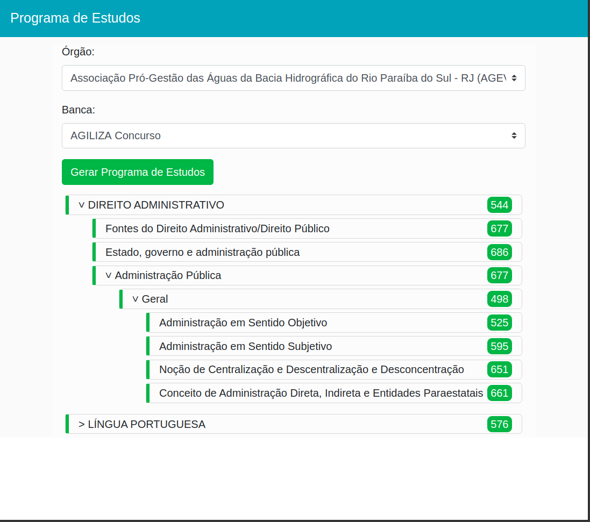

Sistema de Programa de Estudos
--------------------------
Para executar o projeto

1 - Para o subir o servidor php-fpm
 ``` 
# docker-compose up --build -d
 ```
1.1 - Executar o composer install
 ```  
# docker-compose exec php composer install
```
1.2 - Para limpar o Banco de Dados MySql
 ```
# docker-compose exec php bin/console doctrine:schema:drop --force
 ```
1.3 - Para criar a estrutura de tabelas
 ```
# docker-compose exec php bin/console doctrine:schema:create
# docker-compose exec php bin/console doctrine:migrations:migrate
 ```

1.4 -  Para executar a carga de dados
```       
# docker-compose exec php bin/console doctrine:fixtures:load 
 ```

Diretórios do projeto
--------------

* images - Repositório de imagens do README.md
* logs - Logs da Aplicação
* nginx - Arquivos de configuração Docker do nginx
* php-fpm - Arquivo de configuração Docker do php-fpm
* symfony - Código fonte da API do projeto
* vuejs - Código fonte do Front-End do projeto


Utilização da API
-------------------

*  Listar Bancas
 ```
    GET - http://symfony.localhost/api/banca/
 ```

*  Listar Órgãos
 ```
    GET - http://symfony.localhost/api/orgao/
 ```

* Gerar Programa de Estudos
 ```
    GET - http://symfony.localhost/api/programa_estudo/?orgao=idDoOrgao&banca=idDaBanca
 ```
 
 
 Front End
 ---------------------
 
* Para abrir a página fron-end basta abrir o arquivo em um navegador: 

 ```
    vuejs/index.html
 ```
 
 


